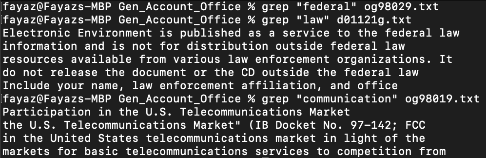

# __Week 5 Lab Report__
*Due on Monday, October 31 🎃*

The command I decided to examine is grep, a command mainly used to discover patterns with files; however, grep is pretty powerful in how it can handle these patterns and provide output in a format we like. 

For this lab, I decided to examine three files in `./technical/government/Gen_Account_Office`
Furthermore to reflect similar functions between all three 

Here is an image of how basic grep searches work for the files I decided to examine.



## Grep -i option

```
% grep -i "federal" og98029.txt      
Subject: Federal Communications Commission: Service and Auction
this is our report on a major rule promulgated by the Federal
6, 1998. It was published in the Federal Register as a final rule
Federal Communications Commission is John Anderson, Director of
and Records Management Federal Communications Commission
ISSUED BY THE FEDERAL COMMUNICATIONS COMMISSION ENTITLED "SERVICE
of Proposed Rulemaking (NPRM) in the Federal Register on January
```

To shortly summarize, grep is able to find patterns but with the -i option we are now expanded to patterns that are
case-insensitive. This becomes incredibly valuable as some cases words are capitalized or not always in the format 
we don't always expect. This is what is found in the above picture and the former code block.

```
% grep -i "law" d01121g.txt       
ELECTRONIC LAW ENFORCEMENT
Contains Sensitive Law Enforcement Information: Not for
Distribution Outside Federal Law Enforcement Entities
Electronic Law Enforcement: Introduction to Investigations in an
Electronic Environment is published as a service to the federal law
information and is not for distribution outside federal law
resources available from various law enforcement organizations. It
do not release the document or the CD outside the federal law
Kevin Manson, Instructor, Financial Fraud Institute, Federal Law
Include your name, law enforcement affiliation, and office
```

Unlike the previous code block running plain grep doesn't result in no lines but `grep -i` expands the output of what is provided.
There are now case-insensitive outputs that are provided and for the right keyword, it may be helpful to know where this word occurs.

```
% grep -i "communication" og98019.txt
Subject: Federal Communications Commission: Foreign
Participation in the U.S. Telecommunications Market
Communications Commission (FCC), entitled "Foreign Participation in
the U.S. Telecommunications Market" (IB Docket No. 97-142; FCC
in the United States telecommunications market in light of the
markets for basic telecommunications services to competition from
Federal Communications Commission is John Anderson, Director of
Records Management Federal Communications Commission
ISSUED BY THE FEDERAL COMMUNICATIONS COMMISSION ENTITLED "FOREIGN
PARTICIPATION IN THE U.S. TELECOMMUNICATIONS MARKET" (IB Docket No.
Communications Act of 1934. 47 U.S.C. §§ 151, 152, 154(i), 201,
```

Similar to the previous code block, more output is provided which than from base grep command which becomes useful if we wanted a full picture 
of how many times this word occurs.

## Grep -c option
```
% grep -ic "federal" og98029.txt     
7
```

While this number may seem arbitrary to a few, we can actually count the nuber of lines to see how many lines that match / were printed from
the previous output. This also helps let us see how we can combine multiple options together.

```
% grep -ic "law" d01121g.txt         
10
```

Similar to the previous output, the number of lines that have the keyword case-insensitive were printed. Now that we're heading to the double digits,
it is quite helpful to see how many matches were actually in the file.

```
% grep -ic "communication" og98019.txt
11
```
There's quite a similar amount of matches compared to the previous code block and it helps that we don't have to count every lien printed by `grep -i` output 
to see the number of case -insenstive matches for the word.

## Grep -n option
Show each example as a code block that shows the command and its output, and write a sentence or two about what it’s doing and why it’s useful.
```
% grep -in "federal" og98029.txt     
14:Subject: Federal Communications Commission: Service and Auction
17:this is our report on a major rule promulgated by the Federal
21:6, 1998. It was published in the Federal Register as a final rule
41:Federal Communications Commission is John Anderson, Director of
47:and Records Management Federal Communications Commission
51:ISSUED BY THE FEDERAL COMMUNICATIONS COMMISSION ENTITLED "SERVICE
94:of Proposed Rulemaking (NPRM) in the Federal Register on January
```

Instead of coupling the previous options, we can now print the `grep -i` with line numbers to see a more information on the lines 
that were selected. This is helpful to see as one could roughly make out wheher there was some pattern between the line numbers and
lines itself.

```
% grep -in "law" d01121g.txt         
13:ELECTRONIC LAW ENFORCEMENT
19:Contains Sensitive Law Enforcement Information: Not for
20:Distribution Outside Federal Law Enforcement Entities
27:Electronic Law Enforcement: Introduction to Investigations in an
28:Electronic Environment is published as a service to the federal law
30:information and is not for distribution outside federal law
32:resources available from various law enforcement organizations. It
80:do not release the document or the CD outside the federal law
90:Kevin Manson, Instructor, Financial Fraud Institute, Federal Law
112:Include your name, law enforcement affiliation, and office
```
As expected, the line numbers were printed for each line based on this keyword and file. We could potentially determine if there is an 
excess amount of the same word in the same paragraph by going of the standard deviation to see the number of occurences the word
has in that select paragraph.


```
% grep -in "communication" og98019.txt
14:Subject: Federal Communications Commission: Foreign
15:Participation in the U.S. Telecommunications Market
18:Communications Commission (FCC), entitled "Foreign Participation in
19:the U.S. Telecommunications Market" (IB Docket No. 97-142; FCC
24:in the United States telecommunications market in light of the
27:markets for basic telecommunications services to competition from
38:Federal Communications Commission is John Anderson, Director of
44:Records Management Federal Communications Commission
48:ISSUED BY THE FEDERAL COMMUNICATIONS COMMISSION ENTITLED "FOREIGN
49:PARTICIPATION IN THE U.S. TELECOMMUNICATIONS MARKET" (IB Docket No.
111:Communications Act of 1934. 47 U.S.C. §§ 151, 152, 154(i), 201,
```
Like before, we see the line numbers printed next to the line the word appears in the file. This becomes useful as if we were later
wanting to go through the file via a linux command (i.e. `less`), we can directly refer to the line number provided by the output.
