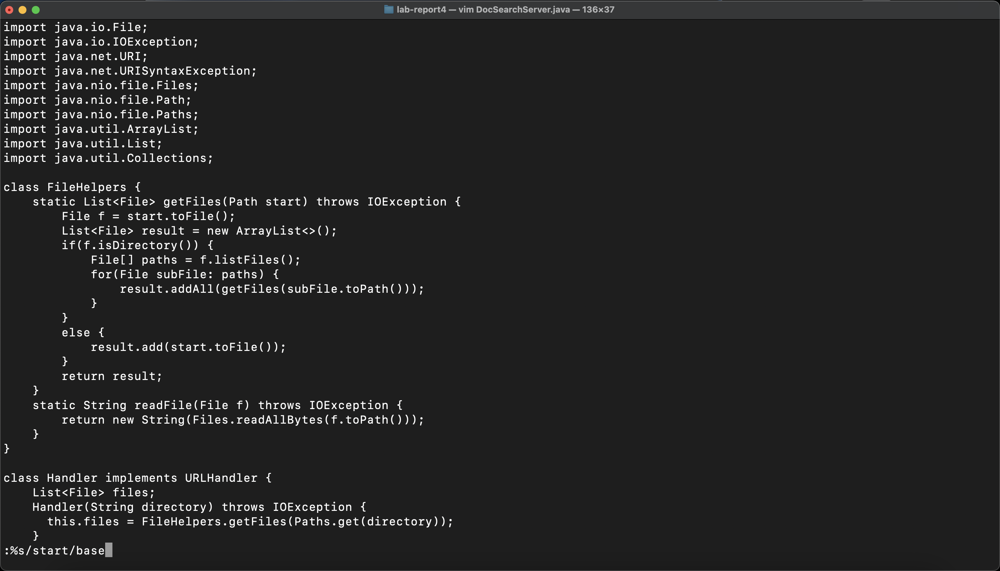
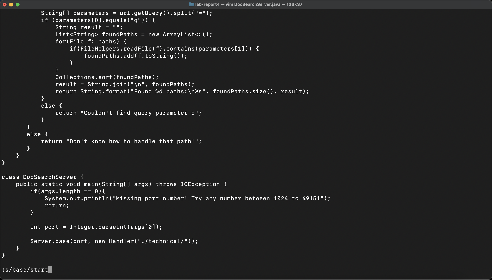
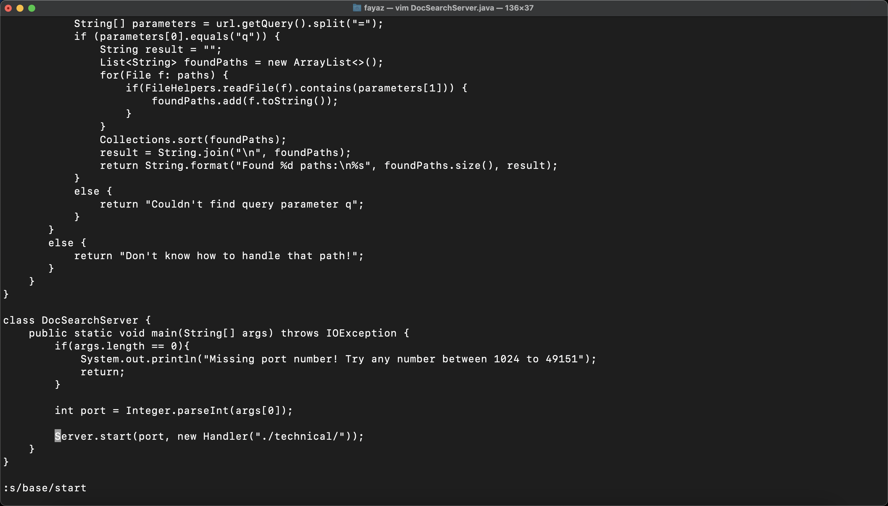

# __Week 3 Lab Report__
*Due on Monday, November 14*

## Part 1
I decided to change the variable of `start` to `base`. To start this process, navigate to the directory and open using vim.

```vim TestDocSearch.java```



We can use some wildcard substitution to edit all the places where start appears by using `:%s/start/base/g` to change all the occurrences.



Because it changes all the places where start appears, it accidentally changes one line where start should appear. The good thing is that our replace command brought us to the line where we want to do the swap. Now this time, we run a replace command that only affects this line and changes the `base` keyword to `start` by using `:s/base/start`.



Tallying up the characters, we get a grand total of 29 characters (just barely enough).

## Part 2
I did the task on both vim and VS code. With vim it took less than a minute but for VS code, it took about two minutes. I wouldn't say the tasks were any different but it just took more time to set up VS code while with vim it was a lot easier.

To answer the first question, I wholeheartedly agree that vim is so much easier to use. Although VS code has a lot more features to use, for simple coding purposes, vim becomes easier. Vim is incldued on all servers as part of linux and with features like subsitution, I'd say that vim is already fancy enough for coding. With compile time errors also appearing on the terminal to alert me whenever an accidental code error comes, these features make vim in a higher regard to VS code in terms of remote coding.

For the second question, some factors that may influence my decision are the number of edits and the number of files I'm dealing with. Note that vim works exceptionally powerful and well for a small amount of files which is why for something in this scenario, my personal take would be vim. But take a lot more file like 20 or so. Each of which have a considerabe amount of code and lots to process. In these scenarios, I can see something like visual studio code. It's formatted elegantly to handle a lot which in this case is. Point is, vim and visual studio code have their own parts to play in helping coders like me and you do amazing work.
