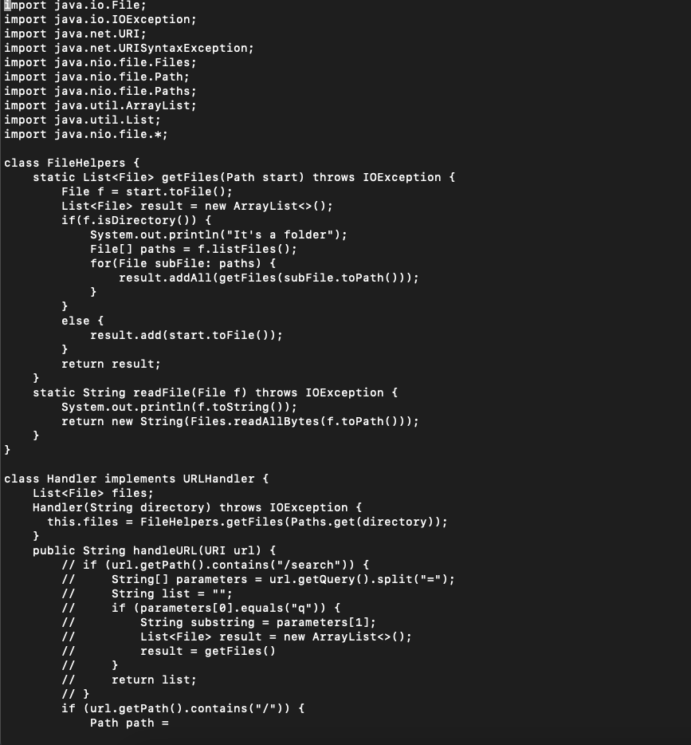
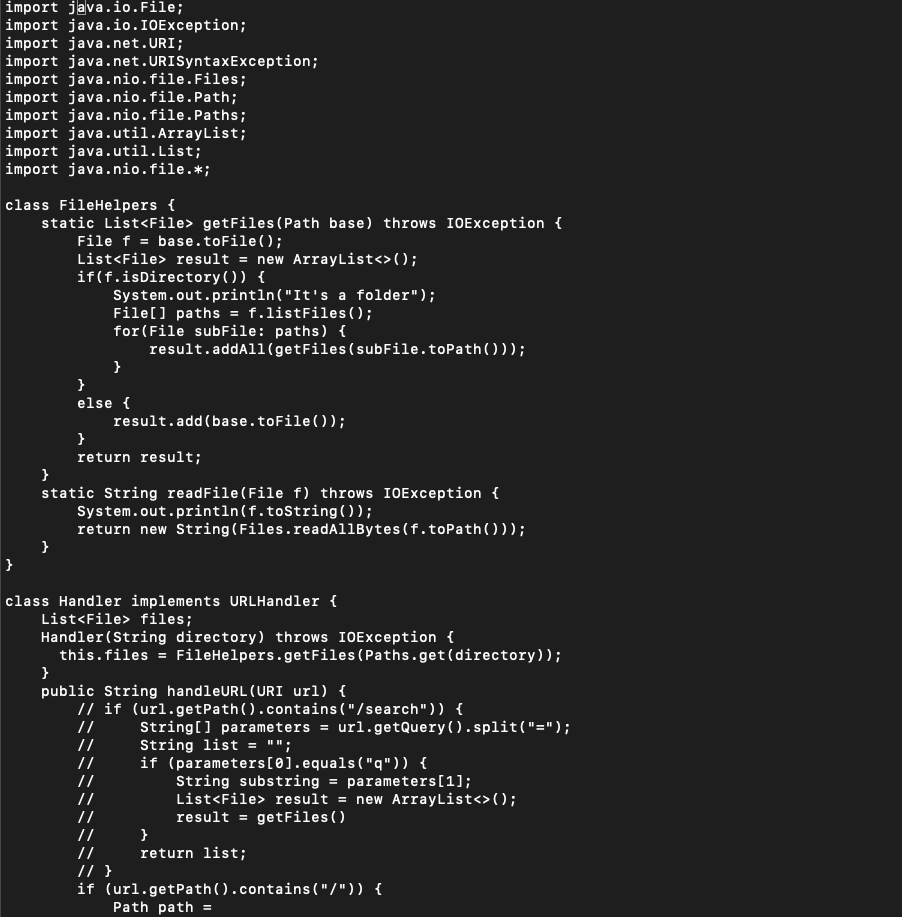
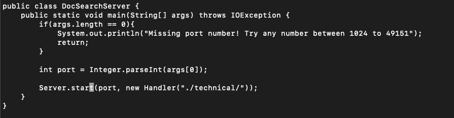

# __Week 3 Lab Report__
*Due on Monday, November 14*

## Part 1
I decided to change the variable of `start` to `base`. To start this process, navigate to the directory and open using vim.

```vim TestDocSearch.java```



We can use some wildcard substitution to edit all the places where start appears by using `:%s/start/base/g` to change all the occurrences.



Because it changes all the places where start appears, it accidentally changes one line where start appears. We can fix this by going manually to last occurrence
where base is now and change it.



## Part 2
I did the task on both vim and VS code. With vim it took less than a minute but for VS code, it took about two minutes. I wouldn't say the tasks were any different but it just took more time to set up VS code while with vim it was a lot easier.

To answer the first question, I wholeheartedly agree that vim is so much easier to use. Although VS code has a lot more features to use, for simple coding purposes, vim becomes easier. Vim is incldued on all servers as part of linux and with features like subsitution, I'd say that vim is already fancy enough for coding. With compile time errors also appearing on the terminal to alert me whenever an accidental code error comes, these features make vim in a higher regard to VS code in terms of remote coding.