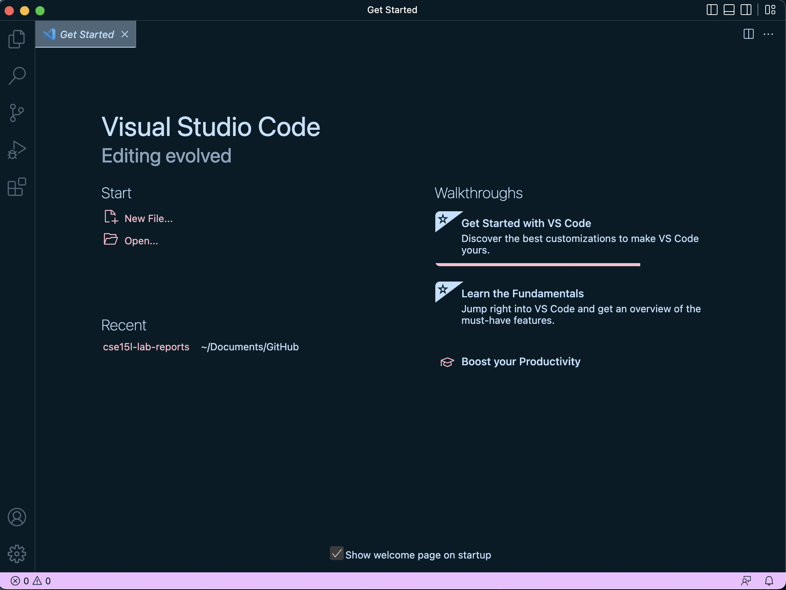
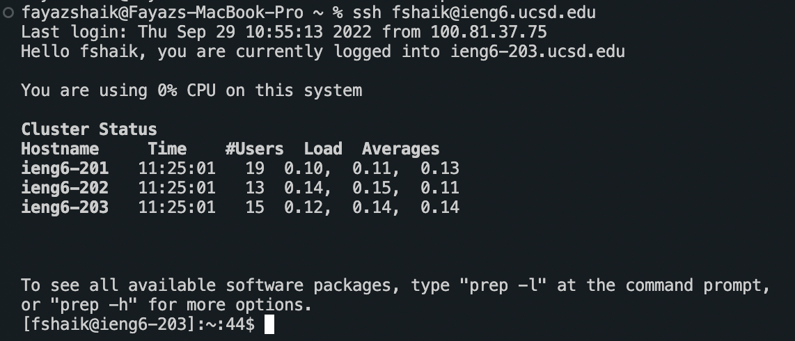
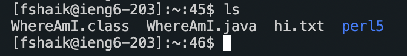
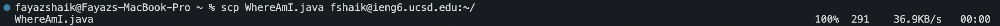
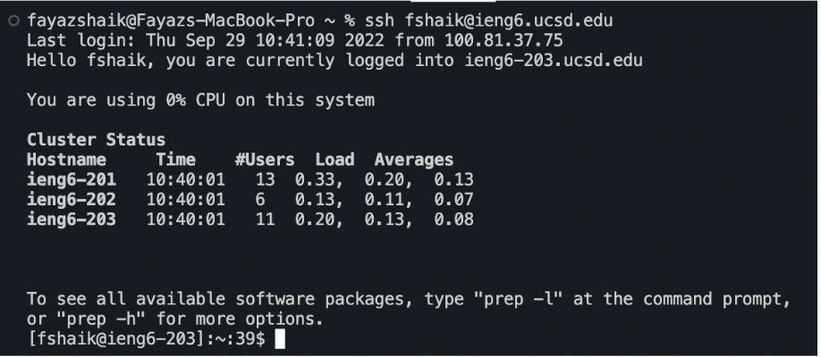
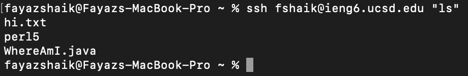

# Week 1 Lab Report
*Due on Friday, September 30*

## Installing VScode
Persnally, I like to use terminal for editing as I grew up old with vi or emacs. But Visual Studio Code does a lot and has a lot of useful features. 

One can install [Visual Studio Code](https://code.visualstudio.com/) by cliking on the link. 

Visual Studio Code is pretty handy as its guides you through the installation process. Hopefully, you can end up with this.



## Remotely Connecting
One can remotely connect to one of UCSD's super computer or any other server you have been authorized access to for better features and other such advantages that a server may have.

MacOS and linux have access to such commands but for windows make sure to install using the [link](https://ucsd-cse15l-f22.github.io/week/week1/#part-4--remotely-connecting:~:text=not%20the%20server%3A-,Install%20OpenSSH,-Then%2C%20in%20Visual).

Make sure to find your unique **CSE15l** account name and enter the following command:

```
$ ssh cs15lfa22zz@ieng6.ucsd.edu
```

Don't worry about the other prompts yet as they're onyl for verifying your identity *(Duo Mobile has competition for security)*



## Trying Some Commands
Once you login to the server, you're paired up with a ***SUPERCOMPUTER*** so take advantage of the resources you have!

> `cd ~`


> `cd`


> `ls -lat`


> `ls -a`


> `cp /home/linux/ieng6/fshaik/public/hello.txt ~/`


> `cat /home/linux/ieng6/cs15lfa22/public/hello.txt`

You can exit out of the server by using the command `exit`.



## Moving Files with scp
`scp` command in linux is pretty useful in the sense that you can copy files from your local computer to the server and vice-versa. Although it's mainly used the first way as you don't want sensitive information on your computer.

Obviously, you first got to create a file for you to use so for our purposes create a file called *WhereAmI.java* and test it out by the way to make sure it works. 

Now afetr checking it works, use scp to connect both sides.

`scp WhereAmI.java fshaik@ieng6.ucsd.edu:~/`

So now if you go log in to the server, you got a lovely-looking file called *WhereAmI.java* waiting for you.



## Setting an SSH Key
Now logging in is a pain, so one can use a SSH key for log in.

Just remember that with easiness comes less security so gaurd that ssh key carefully. 

Run `ssh-keygen` to generate a new keygen file used to substitute loggin into the server. You'll want to copy this file to your server which is done by logging in first, creating a .ssh file & securely copying your keygen file into there. 



## Optimizing Remote Running
Now is the fun part. You got everything set up! How so?
> * You can log in quickly.
> * You can copy files quickly (depending on wifi)
> * You have access to a ***SUPERCOMPUTER***

You can make things even easier by combining commands and doing other cool stuff. Your creativity's the limit.

`ssh fshaik@ieng6.ucsd.edu "ls"`



Best of luck in lab 2, future Fayaz!
