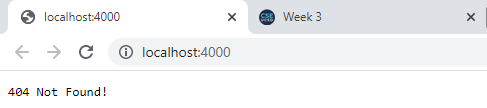
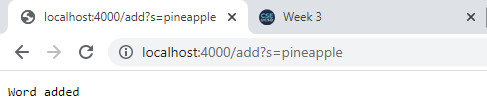
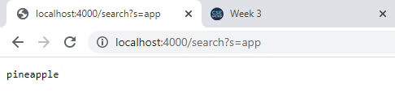
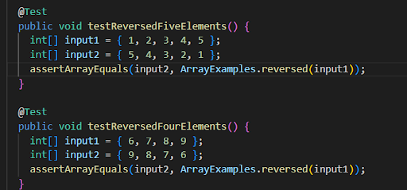
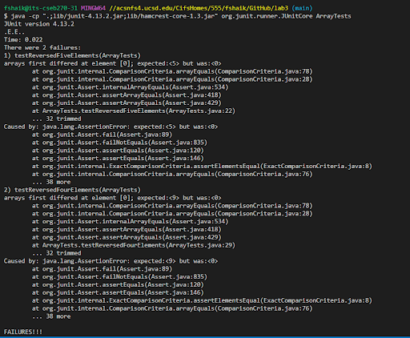
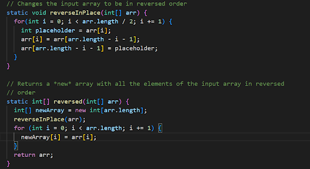
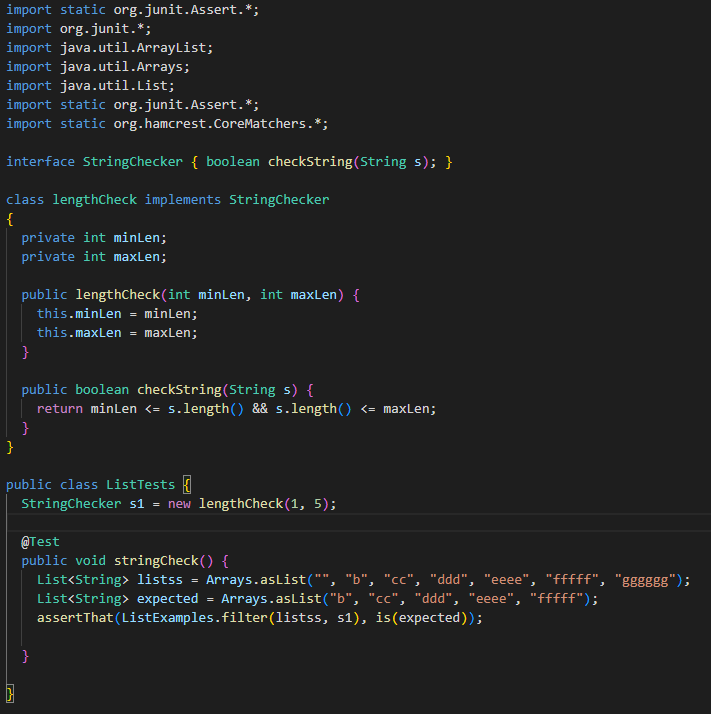
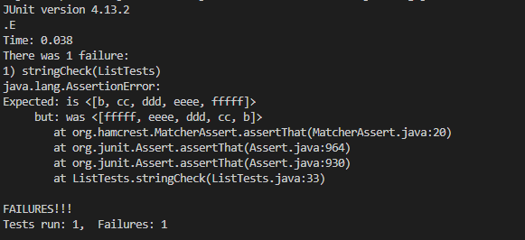
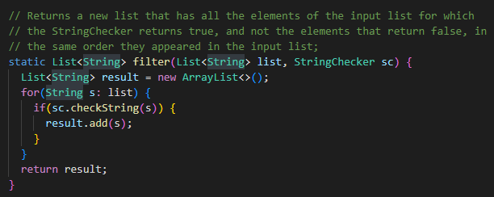

# __Week 3 Lab Report__
*Due on Friday, October 14*

# Part 1
From my Github repository, here is my take on the **Simplest Search Engine**. Note that all the functionalities of the three different cases are done in the same method but in different if-else statements, similar to how *NumberServer.java* worked.

```
class SearchHandler implements URLHandler {
    // The one bit of state on the server: a number that will be manipulated by
    // various requests.
    String[] words = new String[0];

    public String handleRequest(URI url) {
        if (url.getPath().contains("/add")) {
            String[] parameters = url.getQuery().split("=");
            if (parameters[0].equals("s")) {
                String[] wordss = new String[words.length+1];
                for (int i = 0; i < words.length; i++) {
                    wordss[i] = words[i];
                }
                wordss[words.length] = parameters[1];
                words = wordss;
            }
            return "Word added";
        }
        else if (url.getPath().contains("/search")) {
            String[] parameters = url.getQuery().split("=");
            String list = "";
            if (parameters[0].equals("s")) {
                String substring = parameters[1];
                for (int i = 0; i < words.length; i++) {
                    if (words[i].contains(substring)) {
                        list = list + words[i] + " ";
                    }
                }
            }
            return list;
        }
        else {
            return "404 Not Found!";
        }
    }
}
```

## Base url for website


This is the webpage that arises when an invalid url is probided. In this case, because the url in the screenshot doesn't have an add or find path in it, an error is produced which is as follows. Note that because this is an error message, there are no relevant arguments, fields or values that this case statement includes. 

## Adding a word to the list


This is the webpage that results when the path is `/add`. For this result to happen, the case statement referred to here is the first if statement which checks that the path is really `/add`. Following that, the getQuery() method as part of the url class is able to extract the query or the string we want to add in our list. Although for the next part, we could use ArrayList instead of Arrays, I decided to use Arrays. By copying all the elements into a new array and adding the newly entered string in the url to this new array, we can now copy it to our old array and print out a positive message.

The main argument for this method would definitely be the url as that's where we're extracting the method to be called (add) and the string to be added.

But the values we are changing within the method is the array we're adding an element too. In my case, this is called words. After adding the word, no other values other than the array are being changed. This value changes based on the request. One could do a time comparison but text on the webpage loads only once the string has been added to the array.

## Querying words from a list with substring


This is the webpage that results when the path is `/search`. In this case, the case statement being referred to is the else-if statement which only works if the path is the one above. The relevant argument for this case is the url which comes from externally and the array that we have been so dilegently changing via the add method. By referring to the substring within the query part in the url, we compare that substring to the strings in the array to ensure everything is going well. Note that the methods being used here athe similar querySplit method as well as the Java contains method to make sure a string has the substring or not. No values are being changed at all as we are simply querying, not adding or deleting.


# Part 2
Below are two such bugs from the different files above that I found.

## ***From ArrayExamples.java***
## The failure-inducing input


This is a sample test I made which tests the reverse method in the ArrayExamples.java. I used a four element and five-element array to test for both even and odd inputs. This follows the similar test cases that were provided in the file already.

## The symptom


This screenshot displays the error that arose indicating that there has been an issue. Notice that one of the big issues here is that there are multiple errors that arose for each test method but failed because there wasn't enough space. As much as space allows, the error list shows that elements aren't in the right space.

## The bug


To resolve this, I made sure to store the elements that were being swapped. The idea was that the elements were being raised so by storing them, we could effectively complete a perfect swap and preserving the data.

If you recall the screenshot of the symptom, recall how in a five element array from {1 ... 5}, element 5 was being replaced by 0. Ordinarily, this wouldn't make sense since 0 wasn't even in part of the array which meant that some data was getting erased. Looking back at the failure-inducing input and the original test, it's clear that this is the case since by tracing the input, the second swapped element is being erased. It would make sense why the bug is resulting in a 0 as the erased element has gotten erased. It's why we can simply fix this by adding an integer which can store the input until it's time to add it back into the array.

## ***From ListExamples.java***
## The failure-inducing input


This code displays the interface and a simple class I made that implements the interface to check for a string and approve it based on it's length. In my test case, I have a list which a variety of lists from lengths 1 - 6 with the acceptable lengths being 1 - 5. 

## The symptom


Looking at the symptom, we see that the expected and the actual list seem to be the same but with one notable difference. That difference and the reason why JUnit was failing is that the arrays appear to be in swapped order rather than the order they are supposed to appear in.

## The bug


The change I made here is that I removed the `0,` in the add method call. This happens because the add method with those arguments puts the newly accepted element in the front of the array.

Recall that the symptom shows that the elements are in reverse order but are the elements that are acceptable, according to the string checker. Now that we have the bug screenshot with us, we can see that the reason this happened is because of the add method call. What's notable is that the method can insert elements into a list either from the reverse or normal order. The add method was doing the opposite of what we wanted so all we had to is switch the order of the list by modfying the add call.

Best of luck in lab 3, future Fayaz!
