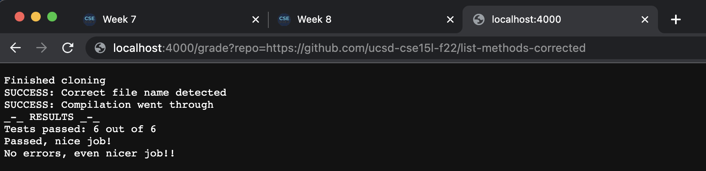
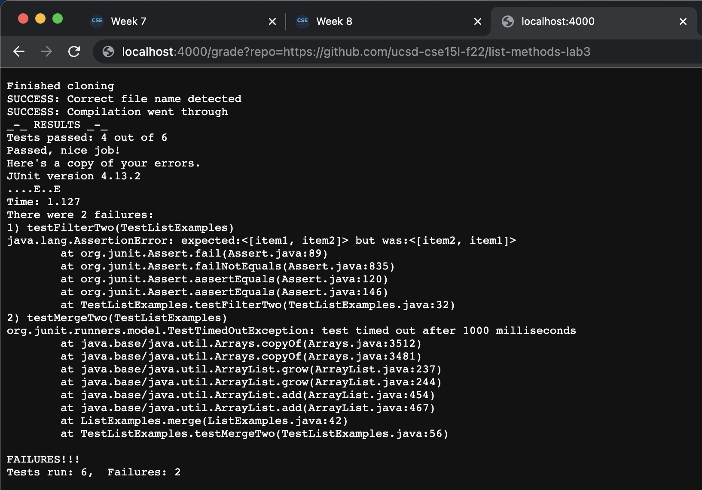
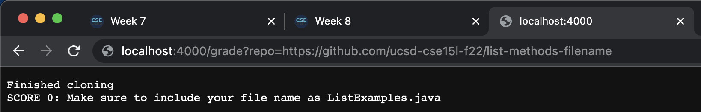

# __Week 3 Lab Report__
*Due on Monday, November 28*

## Here's my grade.sh code
```
# Create your grading script here
CPATH=".:../lib/hamcrest-core-1.3.jar:../lib/junit-4.13.2.jar"

set -e

# 1) Clone the repository of the student submission to a well-known directory name
rm -rf student-submission
git clone $1 student-submission
echo 'Finished cloning'

# 2) Check that the student code has the correct file submitted. If they didn’t, detect and give helpful feedback about it.
cd student-submission
if [[ -f ListExamples.java ]]
then
	echo "SUCCESS: Correct file name detected"
else
	echo "SCORE 0: Make sure to include your file name as ListExamples.java"
	exit 1
fi

# 3) Somehow get the student code and your test .java file into the same directory
cp ../TestListExamples.java TestListExamples.java

# 4) Compile your tests and the student’s code from the appropriate directory with the appropriate classpath commands. If the compilation fails, detect and give helpful feedback about it.
set +e
javac -cp $CPATH *.java 2> cerror.txt
if [[ $? -ne 0 ]]
then
	echo "SCORE 0: ListExamples.java didn't compile and exited with code `echo $?`; try again"
	EXIT 1
fi

echo "SUCCESS: Compilation went through" 
java -cp $CPATH org.junit.runner.JUnitCore TestListExamples > output.txt

# 5) Run the tests and report the grade based on the JUnit output
PASSED=$(((6-`grep -w E output.txt | grep -o 'E' | grep -c .`)))
echo "_-_ RESULTS _-_"
echo "Tests passed: $PASSED out of 6"
if [[ $PASSED -ge 3 ]]
then
	echo "Passed, nice job!"
else
	echo "Failed, try even improving your code!"
fi
if [[ $PASSED -eq 6 ]]
then
	echo "No errors, even nicer job!!"
else
	echo "Here's a copy of your errors."
	cat output.txt
fi

exit 0
```

## And here's some screenshots







## Time to understand the deeper level of this code

To understand what's happening in terms of a trace, I'll go through the successful student's repository which has no errors and passed my script.

* ```
    PATH=".:../lib/hamcrest-core-1.3.jar:../lib/junit-4.13.2.jar"

    set -e
    ```

This block declares our path variable to find the right libraries used for testing purposes and we also declare our set flag off to ensure that if we get an error we'll exit immediately

*   ```
    # 1) Clone the repository of the student submission to a well-known directory name
    rm -rf student-submission
    git clone --quiet $1 student-submission
    echo 'Finished cloning'
    ```

This block is intended to remove any old student's code and replace it with the new version (provided by the argument) and provide a success message. For the first two lines no output or error is generated as these lines don't produce any. The special feature of the `--quiet` option is that it supresses the traditional messages of "cloning ..." and all the fancy Github verbatim. The final echo line is used to generate a success message where the text in quotes are the output but no error is generated. Each of these return codes are 0 since the repository does exist and the rm & echo lines always return 0.

*   ```
    # 2) Check that the student code has the correct file submitted. If they didn’t, detect and give helpful feedback about it.
    cd student-submission
    if [[ -f ListExamples.java ]]
    then
        echo "SUCCESS: Correct file name detected"
    else
        echo "SCORE 0: Make sure to include your file name as ListExamples.java"
        exit 1
    fi
    ```

This block is used to detect if the correct file is included. The first line of cd outputs nothing, has no error as the directory does exist and returns 0 for something successful. Now we get to the fancy if-statement which does work successfully as this submission does have such a file in the `student-submission` directory. For this reason, the then statement executes indicating a success message. As before from the echo statement, the output is the line in quotes, there is no error for an echo command and the return code is 0. 

Since the if statement was true, the else block does not execute, this would happen if the file isn't included or in the wrong directory. This block is used to indicate an early exit and error message.

*   ```
    # 3) Somehow get the student code and your test .java file into the same directory
    cp ../TestListExamples.java TestListExamples.java
    ```

This block is used to move the files from the parent directory to the child directory we're in. This is done by a cp command which outputs nothing, has no error but has a return code of 0 since it was successfull.

*   ```
    # 4) Compile your tests and the student’s code from the appropriate directory with the appropriate classpath commands. If the compilation fails, detect and give helpful feedback about it.
    set +e
    javac -cp $CPATH *.java 2> cerror.txt
    if [[ $? -ne 0 ]]
    then
        echo "SCORE 0: ListExamples.java didn't compile and exited with code `echo $?`; try again"
        EXIT 1
    fi
    ```

This block, now seeing all the code in the same directory, can run the fun tests. First is setting the set flag to it's original value as we don't want to exit the code in case javac does in case have a nonzero error message. Because this code is successful, the first two lines have no output or error and an error code of 0. 

The subsequent if block also doesn't go through since the error code is 0. This if block is used to have an early exit if javac does indeed fail and displays the nonzero code of what happened.

*   ```
    echo "SUCCESS: Compilation went through" 
    java -cp $CPATH org.junit.runner.JUnitCore TestListExamples > output.txt
    ```

This block is relatively straightforward where we display a success message if we got this far and now runs the code. For this successfull submission, the output and error is none and the return code is 0.

*   ```
	# 5) Run the tests and report the grade based on the JUnit output
	    PASSED=$(((6-`grep -w E output.txt | grep -o 'E' | grep -c .`)))
	    echo "_-_ RESULTS _-_"
	    echo "Tests passed: $PASSED out of 6"
	    if [[ $PASSED -ge 3 ]]
	    then
		echo "Passed, nice job!"
	    else
		echo "Failed, try even improving your code!"
	    fi
	    if [[ $PASSED -eq 6 ]]
	    then
		echo "No errors, even nicer job!!"
	    else
		echo "Here's a copy of your errors."
		cat output.txt
	    fi
	    exit 0
    ```

Getting this far, this block is used to calculate the scores of what happened from the run, how many tests were passed and what's the final score for the student. The PASSED variable is used to store the number of tests that passed. This in itself if a result of three commands working together. From before the output of the java command is outputted to the output.txt file. My approach to count the number of failures is by counting the number of E's that appear in a sample output. So the first grep command generates the line where the E's appear. For our case, the output is nothing since there are no E's and no error since the command executed. But the return code will be 1 since this is a successful submission and no tests have failed. From there, we do another grep statement that takes that line of E's we would have and rearranges them to seperate lines for use in the next command. Again, since there are no failures the output and error is 0 but the return code is 1. Now is where grep works again by counting the number of lines there are (in this case no errors so 0 lines). Everything aforementioned is same. All this result is then subtracted by 6 which is stored in variable PASSED. Note that because the other three statements have been producing a return code of 1, the assignment also provides a return code of 1. From there two echo statements happen both of which result in a output and error of nothing and a return code of 0. 

From here, two if statements happen in the purpose of generating unique outputs. My defintion for passed is if 3 or more tests are successfull. This happens when the value of the PASSED is greater than 3 which in this case is. The subsequent then block executes saying the person passed which follows the pattern of all the echo statements.
The next if statement only works if the person fully passed which in this case is true as PASSED equals 6. It echoes the message that error have risen and a happy message about that.

Below is a compilation of all the lines that do not run in chronoligcal order:
```
else
	echo "SCORE 0: Make sure to include your file name as ListExamples.java"
	exit 1

then
	echo "SCORE 0: ListExamples.java didn't compile and exited with code `echo $?`; try again"
	EXIT 1

else
	echo "Failed, try even improving your code!"

else
	echo "Here's a copy of your errors."
	cat output.txt
```
